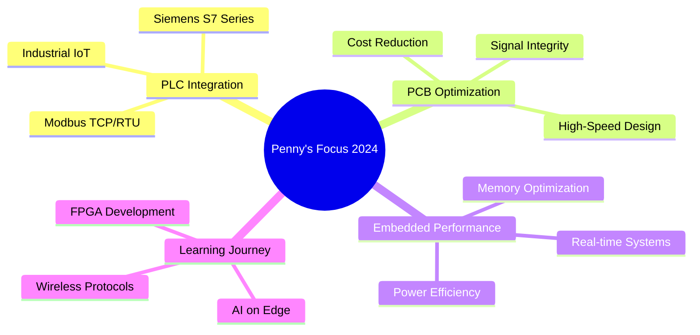

# 👋 Hey there! I'm Penny Dev

<div align="center">
  
[](https://git.io/typing-svg)


[](https://github.com/tinybutpenny)
[](https://github.com/tinybutpenny)

</div>

---

## 🎯 About Me

```cpp
class PennyDev {
private:
    string name = "Penny";
    string role = "Embedded Systems Developer";
    vector<string> skills = {"C/C++", "PCB Design", "PLC Programming", "RS485"};
    
public:
    void getCurrentFocus() {
        cout << "🔥 Currently exploring PLC-MCU communication protocols\n";
        cout << "⚡ Building production-ready PCB modules\n";
        cout << "🎯 Optimizing embedded system performance\n";
    }
    
    string getPhilosophy() {
        return "Clear logic > Fancy code 💡";
    }
};
```

<details>
<summary>🧠 More about my approach</summary>

- 🎯 **Logic-first mindset** - I believe in understanding the problem deeply before coding
- ⚡ **Performance-driven** - Every line of code should serve a purpose
- 🔧 **Hardware-software synergy** - Bridging the gap between PCB design and firmware
- 📚 **Continuous learner** - Technology evolves, and so do I
- 🤝 **Collaboration enthusiast** - Best solutions come from diverse perspectives

</details>

---

## 🛠️ Tech Arsenal

<div align="center">

### 💻 Languages & Frameworks


### 🔧 Development Tools


### 🔌 Hardware & PCB Design


### 🏭 Industrial Automation


</div>

---

## 📊 GitHub Analytics

<div align="center">
  


</div>

<div align="center">

[](https://git.io/streak-stats)

</div>

<div align="center">


</div>

---

## 🚀 Featured Projects

<div align="center">

[](https://github.com/tinybutpenny/Console-Supermarket)
[](https://github.com/tinybutpenny/RS485-MCU-PLC)

</div>

### 🛒 Console Supermarket Management System
**Tech Stack:** `C++` `OOP` `STL` `File I/O`

Advanced inventory management system featuring:
- 🏗️ **Clean Architecture** - Separation of concerns with proper class hierarchy
- 💾 **Persistent Storage** - File-based data management with error handling  
- 🔄 **CRUD Operations** - Complete product lifecycle management
- 📊 **Reporting System** - Sales analytics and inventory tracking
- ✨ **Modern C++** - Smart pointers, RAII, and STL containers

### 📡 RS485 PLC-MCU Communication Bridge  
**Tech Stack:** `C++` `Modbus RTU` `RS485` `PLC Programming`

Industrial-grade communication protocol implementation:
- ⚡ **Real-time Data Exchange** - Sub-millisecond response times
- 🔐 **Error Detection & Recovery** - CRC validation and automatic retries
- 🎛️ **Multi-device Support** - Up to 247 devices on single bus
- 📈 **Performance Monitoring** - Built-in diagnostics and logging
- 🏭 **Production Ready** - Tested in industrial environments

### 🔌 PCB Power Management Module
**Tech Stack:** `Altium Designer` `Analog Design` `Power Electronics`

Custom power supply solution featuring:
- ⚡ **High Efficiency** - 95%+ conversion efficiency
- 🌡️ **Thermal Management** - Advanced heat dissipation design
- 🛡️ **Protection Circuits** - Over-voltage, over-current, thermal shutdown
- 📏 **Compact Form Factor** - Optimized for space-constrained applications
- ✅ **EMC Compliance** - Meets industrial electromagnetic standards

---

## 🎖️ Achievements & Certifications

<div align="center">

| 🏆 Achievement | 📅 Year | 🎯 Description |
|:---:|:---:|:---|
| 🔧 **Embedded Systems Certification** | 2024 | Advanced microcontroller programming |
| 📐 **PCB Design Professional** | 2023 | Multi-layer PCB design & manufacturing |
| 🏭 **Industrial Automation** | 2023 | PLC programming & SCADA systems |
| ⚡ **High-Speed Digital Design** | 2024 | Signal integrity & EMC compliance |

</div>

---

## 📈 Current Focus

<div align="center">



</div>

---

## 📞 Let's Connect!

<div align="center">

[](https://github.com/tinybutpenny)
[](mailto:duongthang090803@gmail.com)
[](#)

**📧 duongthang090803@gmail.com**

</div>

---

<div align="center">

### 💭 Quote of the Day
*"The best code is not just functional, but elegant, maintainable, and tells a story."*

**Thanks for stopping by!** ⭐ Feel free to explore my repositories and don't hesitate to reach out for collaboration!

---


</div>
